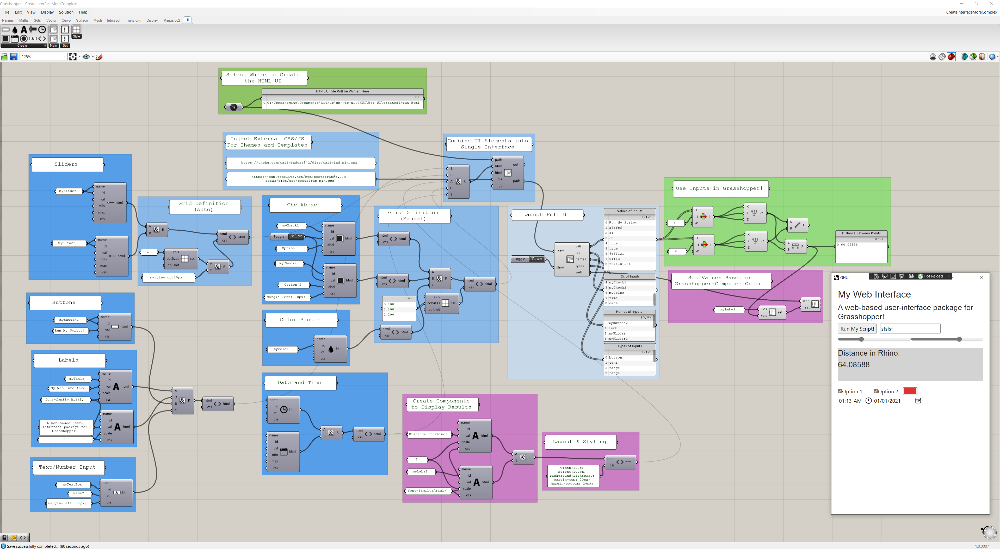

# Grasshopper Web UI

Prototype for building a Grasshopper interface using native web components.

## Development

1. Clone locally
2. Re-link and restore dependencies
3. Build (everything shoudl copy to the Grasshopper/Libraries location)
4. Open the [`ServeInterface.gh`](./grasshopper/ServeInterface.gh)

## Usage

### Build/Use

If you need/want to make modifications/contributions to this package, please refer to the **Development** section above.

If you just want to *use* the package, please refer to the [Releases section of GitHub](https://github.com/mitevpi/gh-web-ui/releases).
From there, download the latest release, unzip the file, and paste the contents into `%appdata%\Grasshopper\Libraries`.

### Hard-Coded UI

The simplest way to use this package is as a dedicated input-receiver by supplying a hard-coded HTML file. This would allow you
to read user inputs, but not add any information to the interface. It would require that you or someone else on your team
has basic web-coding skills, as they're needed to write the interface. Samples of these kinds of interfaces can be found in
the [`Web UI`](GHUI/Web%20UI) folder.

After building the `.gha` from source, you can open the [Grasshopper File](grasshopper/ServeInterface.gh) for testing of this workflow.

|                         Links                          |                     Sample                      |
| :----------------------------------------------------: | :---------------------------------------------: |
|        [Vue.js UI](GHUI/Web%20UI/InputVue.html)        |           |
| [Bootstrap HTML UI](GHUI/Web%20UI/InputBootstrap.html) |  |

### Grasshopper-Created UI

This method of using the package is closer to the familiar Grasshopper UI paradigm, as established by Andrew Heumann in
[Human UI](https://bitbucket.org/andheum/humanui/src/master/). The goal is that the user can use Grasshopper to build a fully-functional 
HTML-based interface without needing to write any kind of textual code. This is still a **Work-In-Progress** 
and will remain that way for quite some time as there are very many elements that must be supported.

|                               Links                                |                           Sample                           |
| :----------------------------------------------------------------: | :--------------------------------------------------------: |
|       [Custom GH UI](grasshopper/CreateInterfaceComplex.gh)        |       |
| [Advanced Custom GH UI](grasshopper/CreateInterfaceMoreComplex.gh) |  |

## Support Map

Currently, the following UI (HTML) [input components](https://www.w3schools.com/html/html_form_input_types.asp) are supported in 
the specified contexts:

| Component    | Read Value from HTML | Create in GH | Set Value from GH Output | Set Label/Props from GH Output |
| ------------ | -------------------- | ------------ | ------------------------ | ------------------------------ |
| Slider       | Yes                  | Yes          | Yes                      | No                             |
| Button       | Yes                  | Yes          | No (Simulate Click)      | No                             |
| Text Input   | Yes                  | Yes          | Yes                      | No                             |
| Radio Button | Yes                  | Yes          | Yes                      | No                             |
| Check Box    | Yes                  | Yes          | Yes                      | No                             |
| Color        | Yes                  | Yes          | Yes                      | No                             |
| Date         | Yes                  | Yes          | Yes                      | No                             |
| Time         | Yes                  | Yes          | Yes                      | No                             |
| Week         | Yes                  | No           | TBD                      | No                             |
| File         | Maybe                | No           | Maybe                    | No                             |
| Text Label   | N/A                  | Yes          | Yes                      | N/A                            |

## Tentative Roadmap

### Abstract

Human UI from Andrew Heumann has been a powerful force in the industry over the last X years - it helps us share and democratize
computational know-how and deliver it to our colleagues who may not be as techincally inclined. I think it's
time for the next step in this journey. With the web becoming the standard for app development, interaction design,
and so much more - I think it makes sense to use it as the backbone for the project.

### Roadmap

- Ensure a Chromium-based execution environment.
- Read values from the DOM.
- Account for most common input-type items that may be in the DOM/needed by users.
- Add elements/outputs to the DOM.
- Create components to build an interface/DOM using Grasshopper only (no web dev knowledge).

## Known Issues

- [GitHub Issues](https://github.com/mitevpi/gh-web-ui/issues)

### Credits

Enormous thanks to everyone who has contributed in any way! I've tried to include everyone here, but I may have missed someone.
If that's the case, I apologize :) - please reach out anytime.

- [Deyan Nenov](https://www.linkedin.com/posts/petr-mitev_chromium-rhino-grasshopper-activity-6779450476074205184-J6Ek)
- [Christopher Connock](https://twitter.com/ChrisConnock/status/1374050893742669824)
- [Ehsan Iran-Nejad](https://www.linkedin.com/in/eirannejad/)
- [Andrew Heumann (Obviously)](https://twitter.com/andrewheumann)
- Andrea Botti
- [Everyone Who's Contributed to the GitHub Issues](https://github.com/mitevpi/gh-web-ui/issues)
- You (Thank you for browsing this project and getting this far in the readme!)
